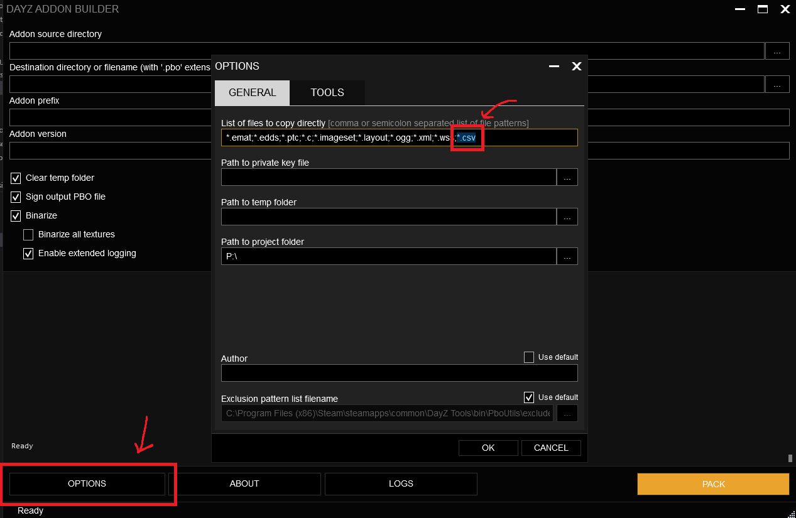

# Introduction
String tables is the primary way you work with localisation. Instead of writing your strings directly in code you store them in a Comma-Separated Values file (CSV from now on) which, when formatted properly, can hold multiple languages of the same string in it and return the correct one based on what language DayZ is set to. By default the string tables only affect Widgets, for console output and logging you're fine just writing text in the scripts since that isn't exactly user-facing anyway.

Bohemia has posted [an example](https://github.com/BohemiaInteractive/DayZ-Samples/tree/master/Test_Stringtable) of a string table setup which is correct and all, but it does lack a lot of the context needed to understand how to use them. You can download their `stringtable.csv` and use that as a baseline, to modify CSV files you can either open it in Microsoft Excel, LibreOffice Calc or any other spreadsheet program. If you're a mental case like me you can also modify them directly in any word processor like Visual Studio Code as they are just stored in clear text. To make the stringtable work for your mod you can paste the `config.cpp` and `stringtable.csv`  into any directory in your mod root, I chose to put it under `P:\ZeroRevival\Data\languagecore\` based on some example I found when figuring this out, but it seems like you can name the directory whatever you want as long as the `config.cpp` and `stringtable.csv` is next to each other. Another thing you need to make sure is that `*.csv` is added to your list of files to export in the Addon Builder, otherwise the string table won't be copied.


The string table values are usable in your mod's scripts and supposedly also in config files, but I have not gotten that to work yet. Using it in scripts is rather easy though, let's use the `stringtable.csv` that Bohemia provided as an example. If you open up that file you will see that it has one key `test_string` which is set to the string `Survive by any means necessary.` in a bunch of languages. If we then find some TextWidget we can use the key to find the correct value like so:
```cpp
// Using an example from the file 'tabberui.c' for the TextWidget
TextWidget control_text = TextWidget.Cast( control.FindAnyWidget( "Tab_Control_x_Title" ) );
// This should make the TextWidget say 'Survive by any means necessary.' if you have the game in English,
// 'Přežij všemi dostupnými prostředky.' if you have it in Czech, and so on.
control_text.SetText("#text_string");
```
Strings that start with the `#` symbol will make Widgets look for the key in stringtables so it will effectively be replaced by the localised string. If the key cannot be found the widget will display the key text.
## Missing Languages
When making a mod, chances are that you are not able to personally translate a string into all the languages that DayZ supports, but it's still a good idea to use string tables. If you are missing a string the game will fall back to the `original` value (the second column) so if you can at least provide one language it's at least something you can work with. Using string tables from the start means that if your mod becomes popular you might be able to find people to help you with localisation in the future, adding new translations is as simple as adding a string to a spreadsheet!
## String Format
If you are a fan of using the `string.Format()` function you'll be happy to hear that you can use that with string tables as well. Simply use the format in the CSV file:
```csv
"Language","original","english","czech","german","russian","polish","hungarian","italian","spanish","french","chinese","japanese","portuguese","chinesesimp",
"string_format_example","My favourite number is %1","My favourite number is %1",,,,,,,,,,,,,
```
And then use the `Widget.TranslateString(string)` function to get the string from the string table, the return string can then be used with `string.Format()`.
```cpp
int favouriteNumber = 7;
string fmt = Widget.TranslateString("#string_format_example");
// Outputs: "My favourite number is 7"
Print(string.Format(fmt, favouriteNumber));
```